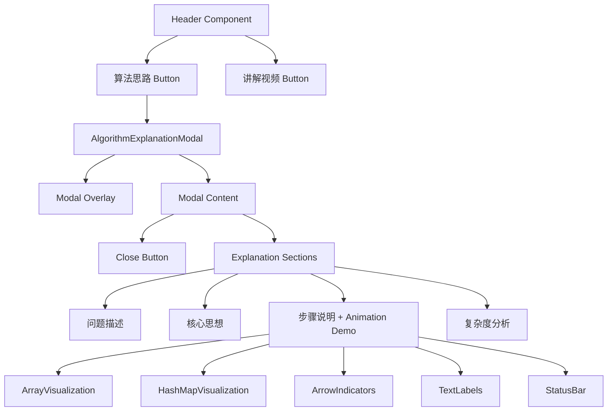
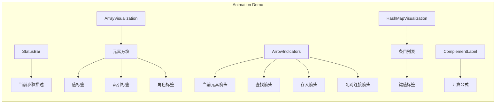

# Design Document: Algorithm Explanation Modal

## Overview

本设计为 LeetCode 两数之和可视化工具添加"算法思路"功能。该功能通过在 Header 组件中添加一个新按钮，点击后弹出模态框展示算法的核心思路。模态框包含一个交互式动画演示区域，通过丰富的文本标签和箭头指示器，直观展示算法的执行过程。设计复用现有的模态框样式模式，保持 UI 一致性。

## Architecture



### 动画演示架构



### 状态管理

- 使用 React `useState` 管理模态框的显示/隐藏状态
- 使用 `useState` 管理动画当前步骤索引
- 使用 `useEffect` 管理动画自动播放定时器
- 与现有视频模态框采用相同的状态管理模式

## Components and Interfaces

### Header Component 修改

在现有 Header 组件中添加：

```typescript
// 新增状态
const [showExplanation, setShowExplanation] = useState(false)

// 新增关闭处理函数
const handleCloseExplanation = () => {
  setShowExplanation(false)
}

// 新增 ESC 键监听
useEffect(() => {
  const handleKeyDown = (e: KeyboardEvent) => {
    if (e.key === 'Escape' && showExplanation) {
      setShowExplanation(false)
    }
  }
  document.addEventListener('keydown', handleKeyDown)
  return () => document.removeEventListener('keydown', handleKeyDown)
}, [showExplanation])
```

### 按钮组件

```typescript
interface ExplanationButtonProps {
  onClick: () => void
}
```

按钮样式与现有 `videoButton` 保持一致，使用蓝色渐变以区分功能。

### 模态框组件

复用现有模态框结构：
- `modalOverlay`: 半透明背景遮罩
- `modalContent`: 内容容器
- `closeButton`: 关闭按钮

### 动画演示组件

```typescript
interface AnimationDemoProps {
  isPlaying: boolean
  onStepChange?: (step: number) => void
}

interface AnimationStep {
  type: 'init' | 'check' | 'search' | 'add' | 'found'
  currentIndex: number
  description: string
  hashMap: Map<number, number>
  complement?: number
  foundIndex?: number
}
```

### 文本标签组件

```typescript
interface TextLabelProps {
  text: string
  position: 'top' | 'bottom' | 'left' | 'right'
  variant: 'default' | 'highlight' | 'success' | 'info'
  animated?: boolean
}

// 标签类型
type LabelType = 
  | 'element-value'      // 元素值标签
  | 'element-index'      // 元素索引标签
  | 'element-role'       // 元素角色标签（正在检查/已存入）
  | 'current-pointer'    // 当前元素指示
  | 'complement-calc'    // 补数计算公式
  | 'hashmap-entry'      // 哈希表条目
  | 'status'             // 状态描述
  | 'result-equation'    // 结果等式
```

### 箭头指示器组件

```typescript
interface ArrowIndicatorProps {
  from: { x: number; y: number }
  to: { x: number; y: number }
  label?: string
  variant: 'pointer' | 'search' | 'add' | 'match'
  animated?: boolean
}

// 箭头类型说明
// pointer: 指向当前元素的箭头（显示"当前元素"）
// search: 查找哈希表的箭头（显示"查找补数"）
// add: 存入哈希表的箭头（显示"存入哈希表"）
// match: 配对成功的连接箭头（显示"找到配对！"）
```

### 内容结构

```typescript
interface ExplanationSection {
  title: string
  icon: string
  content: React.ReactNode
}

const EXPLANATION_SECTIONS: ExplanationSection[] = [
  { title: '问题描述', icon: '📋', content: ... },
  { title: '核心思想', icon: '💡', content: ... },
  { title: '步骤说明', icon: '📝', content: ... },  // 包含动画演示
  { title: '复杂度分析', icon: '⚡', content: ... }
]
```

## Data Models

### 算法思路内容

内容为静态数据，直接在组件中定义：

```typescript
const ALGORITHM_EXPLANATION = {
  problemDescription: {
    title: '问题描述',
    content: '给定一个整数数组 nums 和一个整数目标值 target，请你在该数组中找出和为目标值 target 的那两个整数，并返回它们的数组下标。'
  },
  coreIdea: {
    title: '核心思想',
    content: '使用哈希表（HashMap）存储已遍历的元素及其索引，实现 O(1) 时间复杂度的查找。'
  },
  steps: {
    title: '步骤说明',
    items: [
      '创建一个空的哈希表',
      '遍历数组中的每个元素',
      '计算当前元素的补数（complement = target - 当前元素）',
      '检查补数是否在哈希表中',
      '如果找到，返回补数的索引和当前索引',
      '如果没找到，将当前元素和索引存入哈希表',
      '继续遍历直到找到答案'
    ]
  },
  complexity: {
    title: '复杂度分析',
    time: 'O(n) - 只需遍历数组一次',
    space: 'O(n) - 哈希表最多存储 n 个元素'
  }
}
```

### 动画演示数据模型

```typescript
// 示例数据
const DEMO_ARRAY = [2, 7, 11, 15]
const DEMO_TARGET = 9

// 动画步骤定义
interface AnimationStep {
  type: 'init' | 'check' | 'calculate' | 'search' | 'add' | 'found'
  currentIndex: number
  description: string
  hashMap: Record<number, number>  // value -> index
  complement?: number
  foundIndex?: number
  labels: LabelConfig[]
  arrows: ArrowConfig[]
}

// 标签配置
interface LabelConfig {
  id: string
  type: LabelType
  text: string
  targetElement: string  // 关联的元素ID
  position: 'top' | 'bottom' | 'left' | 'right'
  visible: boolean
}

// 箭头配置
interface ArrowConfig {
  id: string
  type: 'pointer' | 'search' | 'add' | 'match'
  from: string  // 起始元素ID
  to: string    // 目标元素ID
  label: string
  visible: boolean
  animated: boolean
}

// 预定义的动画步骤序列
const ANIMATION_STEPS: AnimationStep[] = [
  {
    type: 'init',
    currentIndex: -1,
    description: '初始化：创建空的哈希表，准备遍历数组',
    hashMap: {},
    labels: [
      { id: 'status', type: 'status', text: '🚀 开始执行算法', targetElement: 'status-bar', position: 'top', visible: true },
      { id: 'arr-0-val', type: 'element-value', text: '2', targetElement: 'arr-0', position: 'top', visible: true },
      { id: 'arr-0-idx', type: 'element-index', text: '索引: 0', targetElement: 'arr-0', position: 'bottom', visible: true },
      // ... 其他数组元素标签
    ],
    arrows: []
  },
  {
    type: 'check',
    currentIndex: 0,
    description: '检查第一个元素：值为 2',
    hashMap: {},
    complement: 7,
    labels: [
      { id: 'status', type: 'status', text: '👉 检查元素 arr[0] = 2', targetElement: 'status-bar', position: 'top', visible: true },
      { id: 'current-role', type: 'element-role', text: '正在检查', targetElement: 'arr-0', position: 'bottom', visible: true },
      { id: 'complement', type: 'complement-calc', text: '补数 = 9 - 2 = 7', targetElement: 'calc-area', position: 'top', visible: true },
    ],
    arrows: [
      { id: 'pointer', type: 'pointer', from: 'pointer-origin', to: 'arr-0', label: '当前元素', visible: true, animated: true },
    ]
  },
  {
    type: 'search',
    currentIndex: 0,
    description: '在哈希表中查找补数 7',
    hashMap: {},
    complement: 7,
    labels: [
      { id: 'status', type: 'status', text: '🔍 在哈希表中查找 7', targetElement: 'status-bar', position: 'top', visible: true },
    ],
    arrows: [
      { id: 'pointer', type: 'pointer', from: 'pointer-origin', to: 'arr-0', label: '当前元素', visible: true, animated: false },
      { id: 'search', type: 'search', from: 'arr-0', to: 'hashmap', label: '查找补数 7', visible: true, animated: true },
    ]
  },
  {
    type: 'add',
    currentIndex: 0,
    description: '未找到补数，将当前元素存入哈希表',
    hashMap: { 2: 0 },
    labels: [
      { id: 'status', type: 'status', text: '❌ 未找到，存入哈希表', targetElement: 'status-bar', position: 'top', visible: true },
      { id: 'hashmap-entry-0', type: 'hashmap-entry', text: '值: 2 → 索引: 0', targetElement: 'hashmap-0', position: 'right', visible: true },
    ],
    arrows: [
      { id: 'add', type: 'add', from: 'arr-0', to: 'hashmap-0', label: '存入哈希表', visible: true, animated: true },
    ]
  },
  // ... 继续检查索引 1
  {
    type: 'check',
    currentIndex: 1,
    description: '检查第二个元素：值为 7',
    hashMap: { 2: 0 },
    complement: 2,
    labels: [
      { id: 'status', type: 'status', text: '👉 检查元素 arr[1] = 7', targetElement: 'status-bar', position: 'top', visible: true },
      { id: 'current-role', type: 'element-role', text: '正在检查', targetElement: 'arr-1', position: 'bottom', visible: true },
      { id: 'prev-role', type: 'element-role', text: '已存入哈希表', targetElement: 'arr-0', position: 'bottom', visible: true },
      { id: 'complement', type: 'complement-calc', text: '补数 = 9 - 7 = 2', targetElement: 'calc-area', position: 'top', visible: true },
    ],
    arrows: [
      { id: 'pointer', type: 'pointer', from: 'pointer-origin', to: 'arr-1', label: '当前元素', visible: true, animated: true },
    ]
  },
  {
    type: 'found',
    currentIndex: 1,
    description: '找到配对！补数 2 在哈希表中，索引为 0',
    hashMap: { 2: 0 },
    complement: 2,
    foundIndex: 0,
    labels: [
      { id: 'status', type: 'status', text: '✅ 找到答案！返回 [0, 1]', targetElement: 'status-bar', position: 'top', visible: true },
      { id: 'result', type: 'result-equation', text: '2 + 7 = 9 ✓', targetElement: 'result-area', position: 'top', visible: true },
    ],
    arrows: [
      { id: 'match', type: 'match', from: 'arr-0', to: 'arr-1', label: '找到配对！', visible: true, animated: true },
    ]
  }
]
```
```

## Correctness Properties

*A property is a characteristic or behavior that should hold true across all valid executions of a system-essentially, a formal statement about what the system should do. Properties serve as the bridge between human-readable specifications and machine-verifiable correctness guarantees.*

### Property 1: Modal content contains all required sections

*For any* render of the Algorithm_Explanation_Modal, the modal content SHALL contain all four required sections: problem description, core idea, step-by-step process, and complexity analysis.

**Validates: Requirements 2.2**

### Property 2: Array elements have complete labels

*For any* array displayed in the Animation_Demo, each element SHALL have both a value label (showing the numeric value) and an index label (showing "索引: N" format).

**Validates: Requirements 4.1**

### Property 3: Current iteration displays correct indicators

*For any* animation step where an element is being checked, the Animation_Demo SHALL display:
- An arrow indicator pointing to the current element with label "当前元素"
- A complement calculation label showing "补数 = target - 当前值 = [result]" with correct arithmetic

**Validates: Requirements 4.2, 4.3**

### Property 4: Hash map entries have formatted labels

*For any* hash map entry displayed in the Animation_Demo, the entry SHALL show a label in the format "值: [value] → 索引: [index]".

**Validates: Requirements 4.7**

### Property 5: Animation state has status description

*For any* animation step, the Animation_Demo SHALL display a status label at the top describing the current operation.

**Validates: Requirements 5.1**

### Property 6: Highlighted elements have role labels

*For any* element that is highlighted in the Animation_Demo, the element SHALL have a role label indicating its current state (such as "正在检查" or "已存入哈希表").

**Validates: Requirements 5.2**

## Error Handling

### 用户交互错误处理

1. **快速重复点击**: 按钮点击后立即更新状态，防止重复触发
2. **模态框关闭冲突**: 使用 `stopPropagation` 防止点击内容区域时意外关闭

### 键盘事件处理

1. **ESC 键关闭**: 仅在模态框打开时响应 ESC 键
2. **事件清理**: 组件卸载时移除事件监听器

### 动画错误处理

1. **步骤越界**: 动画步骤索引超出范围时自动重置到初始状态
2. **定时器清理**: 组件卸载或模态框关闭时清理动画定时器
3. **状态同步**: 确保标签和箭头状态与当前步骤同步

## Testing Strategy

### 单元测试

使用 Vitest 和 React Testing Library：

1. **按钮渲染测试**: 验证按钮正确渲染且位置正确
2. **点击交互测试**: 验证点击按钮打开模态框
3. **关闭功能测试**: 验证点击关闭按钮、点击遮罩、按 ESC 键都能关闭模态框
4. **无障碍测试**: 验证 aria-label 属性存在
5. **动画步骤测试**: 验证动画步骤正确切换
6. **标签渲染测试**: 验证各类标签正确显示

### 属性测试

使用 fast-check 进行属性测试：

1. **内容完整性属性测试**: 验证模态框始终包含所有必需的内容部分 (Property 1)
2. **数组标签完整性测试**: 验证每个数组元素都有值和索引标签 (Property 2)
3. **当前迭代指示器测试**: 验证当前元素有正确的箭头和补数计算 (Property 3)
4. **哈希表条目格式测试**: 验证哈希表条目标签格式正确 (Property 4)
5. **状态描述测试**: 验证每个步骤都有状态描述 (Property 5)
6. **角色标签测试**: 验证高亮元素有角色标签 (Property 6)

### 测试配置

- 属性测试运行至少 100 次迭代
- 每个属性测试需标注对应的设计文档属性编号
- 格式: `**Feature: algorithm-explanation, Property {number}: {property_text}**`

### 视觉回归测试（可选）

- 使用截图对比验证动画各步骤的视觉效果
- 验证箭头和标签的位置正确性
