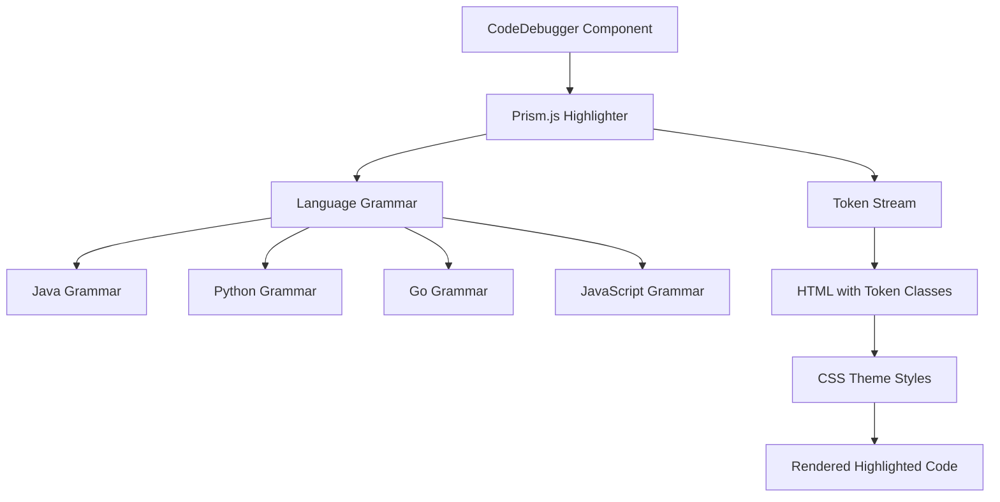

# Design Document

## Overview

本设计文档描述了 Two Sum 可视化器中代码调试器组件的语法高亮功能实现。项目已使用 Prism.js 作为语法高亮引擎，但当前高亮效果可能未正确显示。本设计将确保 Java、Python、Go 和 JavaScript 四种语言都能正确显示语法高亮。

## Architecture



### 核心流程

1. CodeDebugger 组件接收代码字符串和语言类型
2. 调用 Prism.highlight() 方法解析代码
3. Prism.js 根据语言语法生成带有 token 类名的 HTML
4. CSS 样式根据 token 类名应用颜色

## Components and Interfaces

### 1. Prism.js 配置

```typescript
// 语言导入
import Prism from 'prismjs'
import 'prismjs/components/prism-java'
import 'prismjs/components/prism-python'
import 'prismjs/components/prism-go'
import 'prismjs/components/prism-javascript'

// 语言映射
const PRISM_LANGUAGE_MAP: Record<CodeLanguage, string> = {
  java: 'java',
  python: 'python',
  golang: 'go',
  javascript: 'javascript',
}
```

### 2. 高亮函数接口

```typescript
/**
 * 高亮单行代码
 * @param line - 代码行字符串
 * @param language - 编程语言
 * @returns 带有 token span 标签的 HTML 字符串
 */
function highlightLine(line: string, language: CodeLanguage): string
```

### 3. Token 类型映射

| Token 类型 | 颜色 | 示例 |
|-----------|------|------|
| keyword | #569cd6 (蓝色) | public, def, func, const |
| class-name | #4ec9b0 (青色) | Map, List, int |
| string | #ce9178 (橙色) | "hello", 'world' |
| number | #b5cea8 (浅绿) | 42, 3.14 |
| function | #dcdcaa (黄色) | twoSum, enumerate |
| comment | #6a9955 (绿色) | // comment |
| punctuation | #d4d4d4 (灰白) | {, }, (, ) |
| operator | #d4d4d4 (灰白) | =, +, - |

## Data Models

### CodeLanguage 类型

```typescript
type CodeLanguage = 'java' | 'python' | 'golang' | 'javascript'
```

### Token 结构 (Prism.js 内部)

```typescript
interface PrismToken {
  type: string      // token 类型，如 'keyword', 'string'
  content: string   // token 内容
  alias?: string    // 别名
}
```

## Correctness Properties

*A property is a characteristic or behavior that should hold true across all valid executions of a system-essentially, a formal statement about what the system should do. Properties serve as the bridge between human-readable specifications and machine-verifiable correctness guarantees.*

### Property 1: Keyword Token Classification

*For any* code string containing language keywords, when highlighted by Prism.js, the output HTML SHALL contain span elements with class "token keyword" wrapping those keywords.

**Validates: Requirements 1.1, 2.1, 3.1, 4.1**

### Property 2: Type/Class-name Token Classification

*For any* code string containing type names or class names, when highlighted by Prism.js, the output HTML SHALL contain span elements with class "token class-name" or "token builtin" wrapping those type names.

**Validates: Requirements 1.2, 2.2, 3.2, 4.2**

### Property 3: String Literal Token Classification

*For any* code string containing string literals, when highlighted by Prism.js, the output HTML SHALL contain span elements with class "token string" wrapping those string literals.

**Validates: Requirements 1.3, 2.3, 3.3, 4.3**

### Property 4: Number Literal Token Classification

*For any* code string containing numeric literals, when highlighted by Prism.js, the output HTML SHALL contain span elements with class "token number" wrapping those numbers.

**Validates: Requirements 1.4, 2.4, 3.4, 4.4**

### Property 5: Function Name Token Classification

*For any* code string containing function definitions or calls, when highlighted by Prism.js, the output HTML SHALL contain span elements with class "token function" wrapping those function names.

**Validates: Requirements 1.5, 2.5, 3.5, 4.5**

### Property 6: Cross-Language Token Consistency

*For any* equivalent token type across different languages, the CSS styling SHALL apply the same color to that token type regardless of the source language.

**Validates: Requirements 5.1**

## Error Handling

### Prism.js 解析失败

当 Prism.js 无法解析代码时，系统应优雅降级：

```typescript
const highlightLine = (line: string): string => {
  if (!line.trim()) return '&nbsp;'
  try {
    const prismLang = PRISM_LANGUAGE_MAP[language]
    const grammar = Prism.languages[prismLang]
    if (grammar) {
      return Prism.highlight(line, grammar, prismLang)
    }
    return escapeHtml(line) // 降级为纯文本
  } catch {
    return escapeHtml(line) // 错误时降级为纯文本
  }
}
```

### 语言不支持

如果请求的语言语法未加载，返回未高亮的代码而不是抛出错误。

## Testing Strategy

### 单元测试

使用 Vitest 测试框架：

1. 测试 highlightLine 函数对各语言的基本高亮
2. 测试错误处理（无效输入、未知语言）
3. 测试空行和特殊字符处理

### 属性测试

使用 fast-check 库进行属性测试：

1. 验证关键字 token 分类的正确性
2. 验证字符串 token 分类的正确性
3. 验证数字 token 分类的正确性
4. 验证跨语言 token 一致性

每个属性测试配置运行 100 次迭代。

测试文件命名：`*.property.test.ts`

测试注释格式：`**Feature: syntax-highlighting, Property {number}: {property_text}**`
